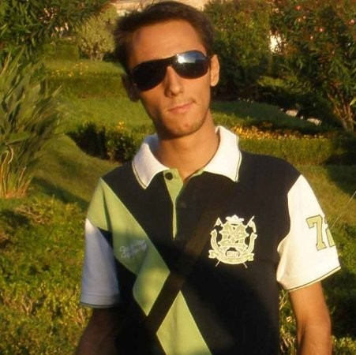
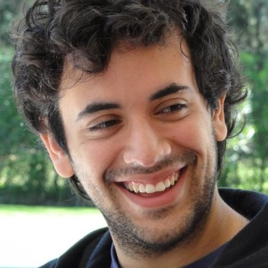

# Kamil Dziedzic

**Go Developer** and **IT Manager**, former PHP and Angular Developer aspiring to become proper ***Software Engineer***.

I'm looking for opportunities to widen my knowledge, experience and expertise in software development alongside with a steady source of income to pursue my dream of building apps for the future.

Feel free to contact me via email [hire@dziedzic.fr](mailto:hire@dziedzic.fr) or [LinkedIn](https://www.linkedin.com/in/kamildziedzic/)

## What can I offer?

* Open mind.
* Dedication to learn.
* 14+ years experience in Web App Development, Product Building and Team Leading.
* 12+ years with Agile, Kanban and Scrum (Professional Scrum Master I, 2012).
* 7+ years experience with Google Go: gRPC, REST, CLI tools, mobile, docker.
* 10+ years with databases: MySQL, PostgreSQL, Amazon DynamoDB, Memcached and MongoDB.
* 6+ years with testing, TDD, CI and CD.
* 1+ year with [Elixir](https://elixir-lang.org/).
* 2+ years with [AngularJS](https://angularjs.org/) and [Node.js](https://nodejs.org).
* 6+ years with developing [PHP](https://www.php.net/) apps (obsolete).
* Professional English with Polish accent, elementary Spanish, forgotten German, and non-existing French.
* A hobbyist photographer, biker, inline skater and swimmer.

### Skills and buzzwords

Feel free to use below list to quickly check if I might have desired skills

`AWS` `Agile Methodologies` `Agile Project Management` `Agile` `Amazon DynamoDB` `Amazon Web Services` `AngularJS` `Ansible` `Azure` `Azure DevOps` `Azure Event Hubs` `Azure Pipelines` `Backbone.js` `Bash` `CI/CD` `Certified Scrum Master` `Coaching` `CoffeeScript` `Continuous Delivery` `Continuous Integration` `DSLR` `Docker` `Echo Labstack` `ElasticSearch` `FCE` `Fedora` `Gin` `Git` `Github` `Github Actions` `Goland` `Golang` `Grafana` `gRPC` `HAProxy` `IT Management` `IntelliJ IDEA` `PhpStorm` `JavaScript` `Jenkins` `Jira` `JSON` `jQuery` `kubernetes` `Linux Mint` `Linux` `MacOS` `Makefile` `Memcached` `Microsoft Teams` `MongoDB` `MySQL` `Nagios` `Node.js` `OpenSUSE` `PHPUnit` `PHP` `Photography` `Project Management` `REST` `RabbitMQ` `Revel` `Rollerblading` `RPM` `Scrum` `Software Development` `SPEC` `Splunk` `Symfony` `TDD` `Team Management` `Test Driven Development` `Testify` `TypeScript` `Ubuntu` `Unit Testing` `Travis` `Web Development` `webpack` `WebSockets` `XML`

### Demo

Most of my work belongs to my employers.  
There are however three exceptions:

1. [Kata 形] is my recent toy project to show of my skills in algorithms and idiomatic Go.
2. [osin-dynamodb] is a Go library which implements the storage for [OSIN](https://github.com/RangelReale/osin) with [Amazon DynamoDB](https://aws.amazon.com/dynamodb/) using [aws-sdk-go](https://github.com/aws/aws-sdk-go). Developed at [Uniplaces](https://www.uniplaces.com/).
3. [ninja-mutex][] [![downloads]][packagist] is a simple to use mutex implementation for php. It supports different adapters (flock, memcache, mysql, redis, ...) so you can set it up as you wish. All adapters (if set up properly) can be used in multiserver environment - in other words lock is shared between web servers. I've created it as a demo of my skills, a demo I could show on job interviews.

All those projects show some of my skills, coding standards and love for testing.

[Kata 形]: https://github.com/arvenil/kata
[osin-dynamodb]: https://github.com/uniplaces/osin-dynamodb
[ninja-mutex]: https://github.com/arvenil/ninja-mutex
[downloads]: https://img.shields.io/packagist/dt/arvenil/ninja-mutex.svg
[packagist]: https://packagist.org/packages/arvenil/ninja-mutex

## What can you offer me?

* steady income (to pay rent, read books and support my family and my hobbies)
* opportunity to learn new programming language
* opportunity to work and exchange knowledge with a team of specialists
* opportunity to share knowledge via blogs and talks
* experience in international product building and team leading
* experience with technologies you use
* opportunity to learn new language (e.g. French, Spanish, German, Mandarin or/and proper English)
* office space
* opportunities to travel

## Interested? Sent me a message!

Do you think my skills could be useful for your company or clients? Can you offer me anything from the list above?

Great! Please contact me via email [hire@dziedzic.fr](mailto:hire@dziedzic.fr)

You might also try to check some of my online profiles:
  
* [LinkedIn](https://www.linkedin.com/in/kamildziedzic)
* [Github](https://github.com/arvenil)
* [Stackoverflow](http://stackoverflow.com/users/916440/kamil-dziedzic)
* [Instagram](https://www.instagram.com/arvenil/) (private, sorry)

If you are interested more in my previous adventures please feel free to scroll down for my full work history with referrals.

# Work History

## Developer at [Derivco Sports](https://derivco.com/) 

*May 2020 - September 2021 (1 year 5 months), Barcelona, Spain*

Certified with [Microsoft Azure Fundamentals](https://www.credly.com/badges/3b2a5a42-c36b-4af5-97a0-3f71798996f5/public_url). Lead Developer of [Double-entry Bookkeeping API](https://en.wikipedia.org/wiki/Double-entry_bookkeeping) in Go. Integrations with customers REST APIs. Replaced outdated and inefficient [Elixir](https://elixir-lang.org/) services with highly efficient and easy to change implementations in Go.

* [Go](https://golang.org/) with [Echo](https://echo.labstack.com/) router for REST APIs.
* [PostgreSQL](https://www.postgresql.org/) for storage and message queue.
* [Microsoft Azure Event Hubs](https://azure.microsoft.com/en-us/services/event-hubs/) for real-time event processing with sharding.
* [Microsoft Azure Pipelines](https://azure.microsoft.com/en-us/services/devops/pipelines/), [Ansible](https://www.ansible.com/), [RPM](https://rpm.org/index.html) and [Docker](https://www.docker.com/) for CI and CD.
* [Nagios](https://www.nagios.org/), [Grafana](https://grafana.com/) and [Splunk](https://www.splunk.com/) for monitoring and logs.
* [HAProxy](http://www.haproxy.org/) for high availability load balancer.

> 
> 
> *My experience with Kamil was that of being with a Golang expert. He knew all the greedy details from the language and always had some optimization/refactor suggestions to make.
> This however, never distracted him from the goal of finishing his tasks on time. Basically speaking, he knew what to do and when - which I think is a great quality many developers I have met missed.
> He was also very team oriented, and generally speaking an easy person to be with - a developer capable of being in any team thanks to his social skills.
> I highly recommend him!*
>
> — <cite>[Pedro Miguel Pereira Serrano Martins], Senior Elixir Programmer</cite>

[Pedro Miguel Pereira Serrano Martins]: https://www.linkedin.com/in/pedro-miguel-pereira-serrano-martins-2b39a171/

<!-- -->

## Software Engineer at [Percona](https://www.percona.com) 

*January 2017 - November 2018 (1 year 11 months), Remote*

Developer of [Percona Monitoring and Management](https://www.percona.com/software/database-tools/percona-monitoring-and-management) - a single pane of glass to easily view and monitor the performance of MySQL, MongoDB, PostgreSQL, and MariaDB databases.

Contributed to several open source repositories: [prometheus/mysqld_exporter](https://github.com/prometheus/mysqld_exporter), [percona/mysqld_exporter](https://github.com/percona/mysqld_exporter), [postgres_exporter](https://github.com/percona/postgres_exporter), [mongodb_exporter](https://github.com/percona/mongodb_exporter), [rds_exporter](https://github.com/percona/rds_exporter), [pmm-client](https://github.com/percona/pmm-client), [pmm-server](https://github.com/percona/pmm-server), [qan-agent](https://github.com/percona/qan-agent), [kardianos-service](https://github.com/percona/kardianos-service), [percona-toolkit](https://github.com/percona/percona-toolkit), [qan-api](https://github.com/percona/qan-api), [qan-app](https://github.com/percona/qan-app), [pmm-managed](https://github.com/percona/pmm-managed).

## Senior Software Developer at [Uniplaces](https://www.uniplaces.com) 

*January 2016 – June 2016 (6 months), Lisbon, Portugal*

Developer of REST microservice for booking app.

* [Gin Web Framework](https://github.com/gin-gonic/gin) for simplified routing.
* [Dependency Injection](https://github.com/karlkfi/inject) for simplified Unit Testing.
* [Amazon DynamoDB](https://aws.amazon.com/dynamodb/) for storage accessed with [AWS SDK for Go](https://github.com/aws/aws-sdk-go).
* Tests written with [testify](https://github.com/stretchr/testify) and run by [CircleCI](https://circleci.com/)
* Code coverage with [Coveralls](https://coveralls.io/).

Developer of OAuth server for a password less authorization.

* Complies with [RFC-6749](https://datatracker.ietf.org/doc/html/rfc6749) with support for ["Resource Owner Password Credentials Grant"](https://tools.ietf.org/html/rfc6749#section-4.3).
* Utilizes [OSIN OAuth2 library](https://github.com/RangelReale/osin) with [osin-dynamodb](https://github.com/arvenil/osin-dynamodb) for storing credentials in [Amazon DynamoDB](https://aws.amazon.com/dynamodb/). 

Developer of [Go Mobile](https://github.com/golang/mobile) library for Android and iOS SDK.

* Common authorization and application layer for Android and iOS mobile apps.

> 
> 
> *I had the pleasure to work with Kamil at Uniplaces.  
> Soon, I was able to notice that he had a deep knowledge of the most relevant technologies that simply make things work as they should.  
> Kamil is a very proactive mate that can finish things nicely done within the deadlines agreed.  
> I believe he is a major addition in any company.*
> 
> — <cite>[Joao Aguiar], Software Engineer</cite>

[Joao Aguiar]: https://www.linkedin.com/in/jsaguiar/

<!-- -->

> 
>
> *Kamil and I worked in the same team at Uniplaces. He started the very first project in Go at Uniplaces.  
> He is very organized, composed and enthusiastic person who will definitely motivate anyone to be a better programmer.   
> He is a very versatile technologist, always open to work with cutting edge technology.  
> He also mentored me and taught me a lot of the concepts of programming.  
> I wish him all the best and given an opportunity I would like to work with him again.  
> I highly recommend Kamil.*
> 
> — <cite>[Ranveer Singh], Software Engineer</cite> 

[Ranveer Singh]: https://www.linkedin.com/in/itsranveer/

<!-- -->

## Go Developer at [Percona](https://www.percona.com) 

*January 2014 – July 2015 (1 year 7 months), Remote*

Developer of Percona Cloud Tools (a precursor of [Percona Monitoring and Management](https://www.percona.com/software/database-tools/percona-monitoring-and-management)).

* [Revel](https://revel.github.io/) web framework for simplified routing, parameter parsing and for crash-free request processing.
* Event based architecture with [RabbitMQ](https://www.rabbitmq.com/) for resource-consuming processing, scalability, non-blocking requests, high-load protection and to utilize sharding.
* [WebSockets](https://en.wikipedia.org/wiki/WebSocket) for real-time server-data analysis.
* Microservice architecture.
* [Memcached](https://memcached.org/) as caching and backend for [service discovery](https://en.wikipedia.org/wiki/Service_discovery).
* [Ubuntu Upstart](https://upstart.ubuntu.com/) for spawning and managing workers.
* Tests written with [gocheck](https://labix.org/gocheck) and run by [Jenkins](https://www.jenkins.io/).

Developer of percona-agent, real-time client-side agent written in golang for Percona Cloud Tools.

* Collects MySQL metrics from:
  * [SHOW GLOBAL STATUS](https://dev.mysql.com/doc/refman/8.0/en/show-status.html) statement.
  * The [INFORMATION_SCHEMA TABLES](https://dev.mysql.com/doc/refman/8.0/en/information-schema-tables-table.html) table.
  * [Performance Schema](https://dev.mysql.com/doc/refman/8.0/en/performance-schema.html) database.
  * [The Slow Query Log](https://dev.mysql.com/doc/refman/8.0/en/slow-query-log.html) (--log-output=file)
* Collects system metrics from [pt-summary](https://www.percona.com/doc/percona-toolkit/latest/pt-summary.html) and [/proc filesystem](https://en.wikipedia.org/wiki/procfs).
* [EXPLAIN Statement](https://dev.mysql.com/doc/refman/8.0/en/explain.html) in real-time thanks to [Websockets](https://pkg.go.dev/golang.org/x/net/websocket).
* Tests written with [gocheck](https://labix.org/gocheck) and run by [Jenkins](https://www.jenkins.io/).

> 
> 
> *Kamil has a great mix of skills as backend, frontend developer as well as understands ops/devops pretty well.  
> Kamil was a great team player always helping his colleagues when asked.  
> Kamil has a great ability to find simple practical solutions to complicated problems.*
> 
> — <cite>[Peter Zaitsev], Founder, CEO</cite>

[Peter Zaitsev]: https://www.linkedin.com/in/peterzaitsev/

<!-- -->

> 
> 
> *Kamil is a Senior Backend Engineer, he did a major work in percona-agent and Percona backend layer.  
> Kamil showed a deep understand of how to design systems and make an implementation.*
>
> — <cite>[Vadim Tkachenko], CTO / Co-founder</cite>

[Vadim Tkachenko]: https://www.linkedin.com/in/vadimtk/

<!-- -->
> 
> 
> *Kamil showed expert level of Go lang knowledge, high quality of work and critical architecture mind.  
> Beside of that Kamil is 1) showing good skills on debugging problems 2) analytic mind with clear explanation of problem and ability to ask right questions and suggest right solutions on the base of answers 3) very attentive to users of the system and support engineers with helping them to solve problems.  
> Also Kamil is showing good discipline, very attentive to teammates and giving a hand for everyone who needs his expert view.  
> And in addition what is most important for manager's view to the team - nice and interesting person.*
>
> — <cite>[Nika Krupitskaya], Project Manager</cite>

[Nika Krupitskaya]: https://www.linkedin.com/in/nikakrupitskaya/

<!-- -->

> 
>
> *Kamil is a very talented developer and a good friend.  
> He has a deep knowledge of Go and other programming languages as well  
> and that turns him in a good fit for almost any project you can imagine. Careful about details, always trying to reach 110% of test coverage and always willing to help, I've really enjoyed working with him. Kamil is not only talented programming computers, but he is also a very open-minded person; I've enjoyed his code reviews, and the discussions we had about technology and the best way of solving problems.  
> He is always trying to improve things and pushes others to do the same.*
>
> — <cite>[Carlos Salguero], Developer</cite>

[Carlos Salguero]: https://www.linkedin.com/in/carlosfsalguero/

<!-- -->

> 
>
> *Kamil is a great person, and he makes the everyday work easier.   
> He has great capacity for analysis, and he is always willing to help and learn new things.   
> His knowledge on backend dev is outstanding.  
> A definite asset on any company.*
>
> — <cite>[Martin Cespedes], Senior QA / Scrum Master</cite>

[Martin Cespedes]: https://www.linkedin.com/in/martin-cespedes-0471196/

<!-- -->

> 
>
> *Kamil is a great developer and an excellent team-mate,  
> I felt very comfortable working with him as a great backend / frontend team.  
> He is an excellent professional with great knowledge.*
>
> — <cite>[Pablo Penén], Senior Frontend Developer</cite>

[Pablo Penén]: https://www.linkedin.com/in/pablopenen/

<!-- -->

> 
>
> *Kamil is a very detail-oriented developer with strong technical and analytic skills.  
> He was the cornerstone of our backend team, he built most of our code base with great speed and quality. He always kept the team focused on what's important leading the technical discussions in the right direction.  
> He's great to be around, a team player and more importantly an awesome person.*
>
> — <cite>[Miguel Paolino], Senior Software Developer</cite>

[Miguel Paolino]: https://www.linkedin.com/in/mpaolino/

<!-- -->

> 
>
> *Kamil is an extremely talented developer, and I was very lucky to work with him.  
> He's a true hacker and brilliant class A programmer, his style is a pleasure to read.  
> He is friendly, outgoing and always has a moment to help address customer concerns.*
>
> — <cite>[Fabian Vallejos], Senior Frontend Developer</cite>

[Fabian Vallejos]: https://www.linkedin.com/in/fabianvallejos/

<!-- -->

> 
>
> *Just a great developer  
> and a great team member to work with.*  
> 
> — <cite>[Francisco Guijarro], Javascript Developer</cite>

[Francisco Guijarro]: https://www.linkedin.com/in/franleplant/

<!-- -->

## PHP and UI Developer at [Percona](https://www.percona.com) 

*September 2013 – December 2013 (4 months), Remote*

Backend and frontend application for Percona Cloud Tools

Frontend:

* [Single-page application](https://en.wikipedia.org/wiki/Single-page_application) written in [AngularJS](https://angularjs.org/).
* Asynchronous requests and notifications through [WebSockets](https://en.wikipedia.org/wiki/WebSocket).
* Metrics data graphed with [Highcharts](https://www.highcharts.com/).
* Tests written in [Jasmine](https://jasmine.github.io/) and run by [Karma](http://karma-runner.github.io/latest/index.html).

Backend: 

* REST api build with [Symfony](https://symfony.com/).
* Storage in [Oracle MySQL](https://www.mysql.com/) and [Percona TokuDB](https://en.wikipedia.org/wiki/TokuDB).
* Database access with [Doctrine ORM](https://www.doctrine-project.org/projects/orm.html).
* Long-time processing handled with [Message queues](https://en.wikipedia.org/wiki/Message_queue) and [Background processes](https://en.wikipedia.org/wiki/Background_process).
* Message queues implemented in [RabbitMQ](https://www.rabbitmq.com/).
* Background processes written in [Symfony](https://symfony.com/) and managed by [Supervisor](http://supervisord.org/).
* Tests written using [PHPUnit testing framework](https://phpunit.de/).

## IT Manager at [FarmaProm Polska](https://www.farmaprom.pl) 

*October 2011 – November 2013 (2 years 2 months), Kraków, Poland*

Development of pharmaceutical platform www.FarmaProm.pl
and delivery new solutions to pharmaceutical companies.

* [Professional Scrum Master](https://www.credly.com/badges/fa2f8968-bec8-4cce-875a-d20ba566d62e) certified on 29th May 2012.
* Introduced [Agile Software Development](https://en.wikipedia.org/wiki/Agile_software_development) into the company, with [Scrum](https://www.scrum.org/) and [Kanban](https://en.wikipedia.org/wiki/Kanban) frameworks.
* Increased [employee satisfaction](https://en.wikipedia.org/wiki/Job_satisfaction) with training opportunities, wider flexibility, more transparency, improved communication, reducing bureaucracy and micromanagement. 
* Greatly reduced risks and software delivery time by familiarizing IT specialist - developers, system administrators, testers - with [continuous delivery](https://en.wikipedia.org/wiki/Continuous_delivery) and implementing the approach.
* Managing tasks and workflows in [Redmine](https://www.redmine.org/).
* Evaluating [engineering cost](https://en.wikipedia.org/wiki/Cost_engineering) for customers.
* Technical support for sales department in contact with clients (pharmaceuticals companies and wholesales).
* Emergency contact for any software problem e.g. app crashes.
* Interviewing and recruiting IT specialists.

> 
> 
> *I would like to say that Kamil is a Programming Jesus.  
> But it might be offensive. Offensive to Kamil.  
> Because he's not going to wait three days to resurrect your dead code.  
> If you have Kamil in your team it will be done unto you even before you ask.*
>
> — <cite>[Michał Górski], Big Data Developer</cite>

[Michał Górski]: https://www.linkedin.com/in/micha%C5%82-g%C3%B3rski-8032a59a/

<!-- -->

## Team Lead and Senior PHP Developer at [Araneo](http://araneo.pl)

*December 2007 – October 2011 (3 years 11 months), Kraków, Poland*
 
Team Lead and Senior PHP Developer for pharmaceutical platform www.FarmaProm.pl:

  * [Sales Force Automation](https://www.farmaprom.pl/en/sfa/)
  * [Medical & Pharmaceutical CRM](https://www.farmaprom.pl/en/crm/)
  * [Manufacturer CRM](https://www.farmaprom.pl/en/manufacturer/)
  * [Wholesaler CRM](https://www.farmaprom.pl/en/wholesaler/)

Team Lead:

* Leading [PHP](https://www.php.net/) team.
* Coordinating work between IT teams: [PHP](https://www.php.net/), [Front-end](https://en.wikipedia.org/wiki/Front-end_web_development), [iOS](https://en.wikipedia.org/wiki/IOS), [Android](https://developer.android.com/), [Windows Mobile](https://en.wikipedia.org/wiki/Windows_Mobile), [System administrators](https://en.wikipedia.org/wiki/System_administrator), [Quality assurance](https://en.wikipedia.org/wiki/Software_quality_assurance).
* Accepting, pricing and coordinating commissions from clients.
* Releasing and deploying new software versions.
* Designing key modifications (from changes in application
engine to modifications operating on customers critical data e.g. wholesales financial data).
* Designing, managing and optimizing large databases
(hundreds tables, tens of gigabytes of data, hundreds millions
records).

PHP Developer:

* Developed [REST](https://en.wikipedia.org/wiki/Representational_state_transfer) and [SOAP](https://en.wikipedia.org/wiki/SOAP) web services for [Windows Mobile](https://en.wikipedia.org/wiki/Windows_Mobile), [iOS](https://en.wikipedia.org/wiki/IOS) and [Android](https://developer.android.com/).
* Established [electronic data interchange](https://en.wikipedia.org/wiki/Electronic_data_interchange) with over 100 pharmaceutical companies and wholesalers. Data formats used: XML+XSLT, CSV, XLS, text files and JSON. Transmission protocols: FTP, FTPS, SFTP and HTTPS. 
* Integration with [Oracle Business Intelligence](https://www.oracle.com/business-analytics/business-intelligence/). Conversion from [relational model](https://en.wikipedia.org/wiki/Relational_model) to [star schema](https://en.wikipedia.org/wiki/Star_schema).
* Debugging, testing, optimizing PHP, SQL and Javascript code.
* [Propel](http://propelorm.org/)
* Improved parallel development by designing
  production and development environment: branches
  hierarchy (stable, release and integration branches;
  feature branches; hotfix branches) in SVN (and later migrated to GIT), automatic merges
  between branches, integration with redmine issue tracking
  system, continuous integration with jenkins, web
  application actualization process (bash/php), automatic
  e-mail reports for deployed releases.
  That was way before [Gitflow](https://nvie.com/posts/a-successful-git-branching-model/) and [GitHub flow](https://docs.github.com/en/get-started/quickstart/github-flow).
* Ensuring data consistency of business critical application
  components (e.g. protection against race conditions or data
  duplication).

> 
>
> *Kamil is well skilled and very sane developer.  
> At the time he successfully kept restrained our biggest,  
> really huge project and made sure that his team does the job well.*
>
> — <cite>[Krzysztof Kowalik], Hacker, Software Developer</cite>

[Krzysztof Kowalik]: https://www.linkedin.com/in/irisdelaluna/

<!-- -->

## PHP Developer at [Krakowskie e-Centrum Informatyczne](https://kei.pl) 

*July 2007 – August 2007 (2 months), Kraków, Poland*

Summer job and my first professional experience.

* Head Developer and designer of [Issue tracking system](https://en.wikipedia.org/wiki/Issue_tracking_system).
* Developer and designer of [Business Directory](https://en.wikipedia.org/wiki/Business_directory).
* Developer of [Website Builder](https://en.wikipedia.org/wiki/Website_builder).
* Maintenance of company's [CRM](https://en.wikipedia.org/wiki/Customer_relationship_management) and other proprietary software.

# Hobbies

* DSLR photography - whenever I have time.
* Travelling - google reports more than 20 countries, so I guess it's a start.
* Swimming - learned in Barcelona and [Costa Brava](https://www.google.com/search?q=costa+brava&tbm=isch), now in the wetsuit continuing on the [French Riviera](https://www.google.com/search?q=french+riviera&tbm=isch).
* Food - it's impossible to say "no" to all delicious regional delights.
* Books - to name few influential: 
  * [Astrophysics for People in a Hurry](https://en.wikipedia.org/wiki/Astrophysics_for_People_in_a_Hurry)
  * [A Brief History of Time](https://en.wikipedia.org/wiki/A_Brief_History_of_Time)
  * [Getting Things Done](https://en.wikipedia.org/wiki/Getting_Things_Done)
  * [The Ghost In The Shell](https://en.wikipedia.org/wiki/Ghost_in_the_Shell_(manga))
  * [The Pragmatic Programmer](https://en.wikipedia.org/wiki/The_Pragmatic_Programmer)
  * [Sapiens: A Brief History of Humankind](https://en.wikipedia.org/wiki/Sapiens:_A_Brief_History_of_Humankind)
* Technology and programming - everything with microprocessor is as exciting as a birthday cake.

# Something not right?

This resume is open source - feel free to fork it, make improvements and create a pull request at [https://github.com/arvenil/arvenil](https://github.com/arvenil/arvenil)
